# Pose Estimation

The project aims to estimate the object's location using a camera. In the course of completing the project, two approaches were tested. The first approach utilizes the [Find Object](https://github.com/introlab/find-object/tree/noetic-devel) ROS package to estimate the object's position. This approach relies on image processing and does not require much time for setup. However, it is heavily dependent on fixed camera and light source locations. The second approach utilizes Deep Object Pose Estimation ([DOPE](https://github.com/NVlabs/Deep_Object_Pose)), where a pre-trained model detects an object's pose. If the model is trained enough, the detection can be more reliable than the first in the case of the second approach. However, the training can take a very long time.

### Test Objects
<p align="center">
 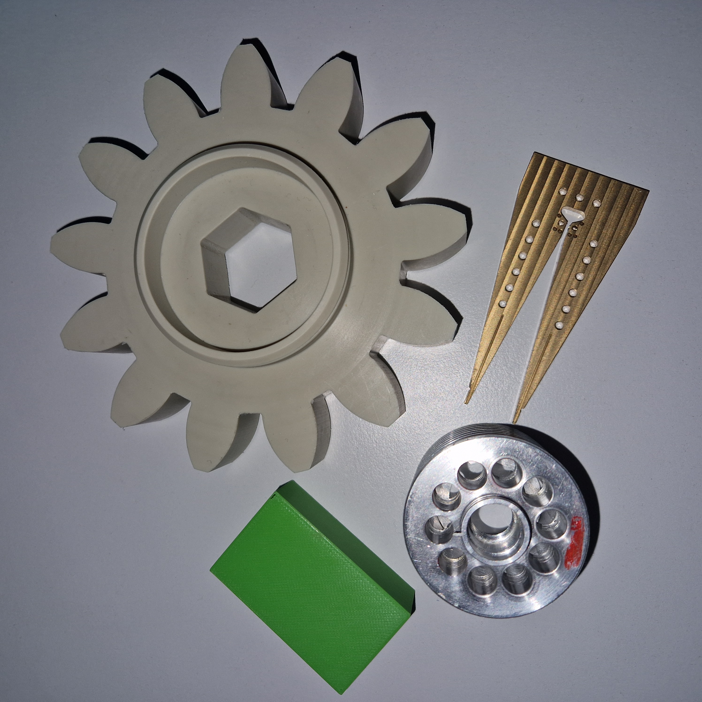
</p>


This repository contains two solutions for pose estimation:
1) Using [Find Object](https://github.com/introlab/find-object/tree/noetic-devel)\
Find object package relies on the image processing approach to estimate the object's location in front of the camera. It takes a reference image of the object and tries to find similar points on the input image.

2) Using [DOPE](https://github.com/NVlabs/Deep_Object_Pose)\
Deep Object Pose Estimation (DOPE) relies on the machine learning approach to estimate the object's location in front of the camera.

### Setup
 * [Ubuntu 20.04](https://releases.ubuntu.com/focal/)
 * [ROS Noetic](http://wiki.ros.org/noetic/Installation/Ubuntu)
 * [Jetson Nano](https://developer.nvidia.com/embedded/learn/get-started-jetson-nano-devkit)
 * [RealSense](https://github.com/IntelRealSense/realsense-ros#installation-instructions)
 * [Find Object](https://github.com/introlab/find-object)

<p align="center">
 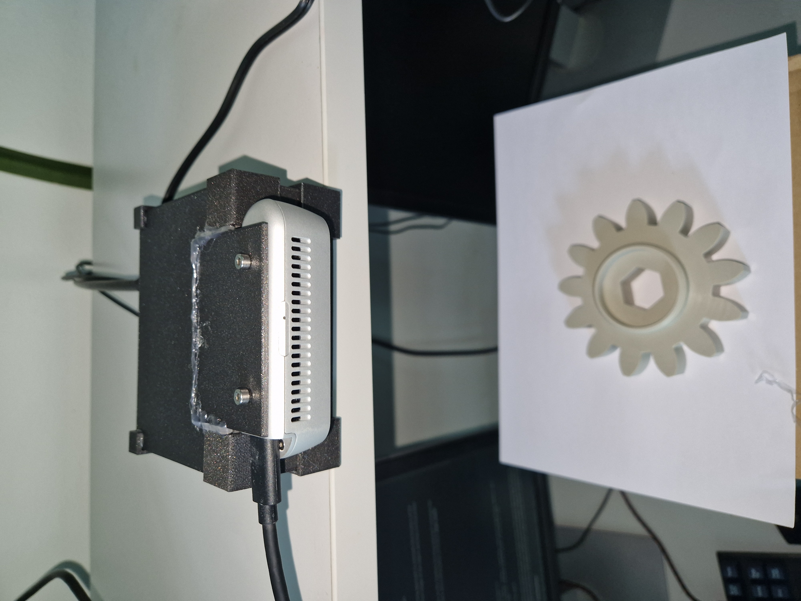
</p>

### Setup the workspace
```bash
sudo apt-get install ros-$ROS_DISTRO-find-object-2d
```
```bash
cd
mkdir -p pose_estimation/src
cd ~/pose_estimation/src
git clone https://github.com/patsyuk03/pose_estimation.git
cd ~/pose_estimation
catkin build
source devel/setup.bash
```
The workspace contains two packages for the approaches described above. 

## Pose Estimation using Find Object

In this approach, the object is detected based on the similarities between the reference and input images. Adding new objects does not take much time. The downside of this method is that some objects are much harder to detect than others. For example, the Gear object can be easily detected with only one reference image. However, the Fork object needs multiple reference images to make it detectable from different locations. There are a couple of reasons why objects can be hard to detect:
1) Light reflection - metallic objects that reflect light are hard to detect because the detection heavily depends on lightning. When the reflective object is moved, the differences between the reference and input images increase due to different light reflections.
2) There is not enough structure - the more light and dark regions there are, the more data points there are for comparison. If an object has a smooth surface without any shadows, there will not be enough points for comparison. 

### Reference images for the Gear and Fork object 
<p align="center">
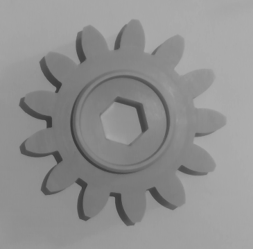
  &nbsp; &nbsp; &nbsp; &nbsp;
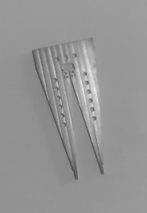
</p>

### Start Pose Estimation
The following command brings up _realsense camera_ and positions it facing downwards using _static transform publisher_. Then it calls _find object_, which starts to detect objects from the image topic published by the camera node. Finally, the coordinates are transformed to the correct frame and published to topic _/object_pose_, which can be visualized in RViz. The _height_ argument can modify the camera's distance from the table.
```bash
roslaunch pose_estimation pose_estimation.launch [rviz:=true] [height:=0.2]
```
<p align="center">

</p>

### Add New Object
We need to use the GUI provided by the find_object package to add a new object. Some objects need more than one snapshot to be normally detected in different positions since this approach is heavily dependent on the lightning.  
```bash
roslaunch pose_estimation pose_estimation.launch add_objects:=true
```
<p align="center">
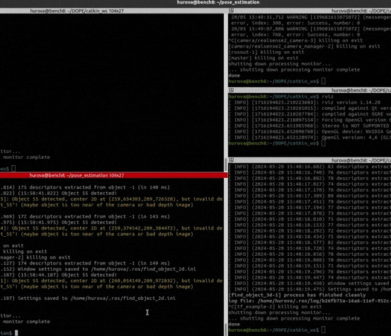
</p>

## Pose Estimation using DOPE
```
@inproceedings{tremblay2018corl:dope,
 author = {Jonathan Tremblay and Thang To and Balakumar Sundaralingam and Yu Xiang and Dieter Fox and Stan Birchfield},
 title = {Deep Object Pose Estimation for Semantic Robotic Grasping of Household Objects},
 booktitle = {Conference on Robot Learning (CoRL)},
 url = "https://arxiv.org/abs/1809.10790",
 year = 2018
}
```
Deep Object Pose Estimation (DOPE) uses a machine-learning approach to find an object's location. Using DOPE for pose estimation requires much more preparation time than Find Object. The most time-consuming part is model training and data generation. Here are the steps that need to be completed before running object detection:

1) 3D Model creation \
First, the 3D model of the object needs to be created. This can be done using SolidWorks and exporting the resulting object in the .stl format. Then using MeshLab apply the texture (color of the object) and save as .obj, it should also generate texture.png file and .mtl. 

<p align="center">
 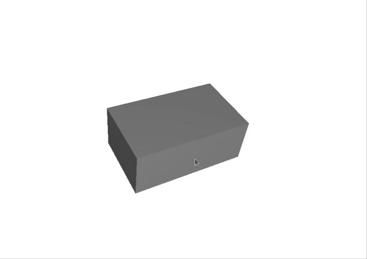
 &nbsp; &nbsp; &nbsp; &nbsp;
 
</p>

2) Data generation \
For model training, data needs to be generated. This can be done using script form [DOPE repositoty](https://github.com/NVlabs/Deep_Object_Pose.git). The process of data generation can take more than 12 hours depending on how many images are set to be generated (usually 20000 should be enough)
<p align="center">
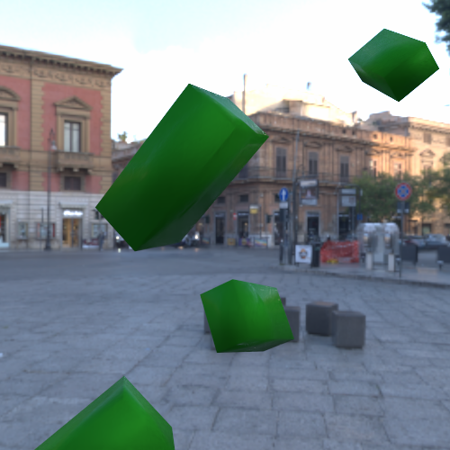
  &nbsp; &nbsp; &nbsp; &nbsp;

 &nbsp; &nbsp; &nbsp; &nbsp;
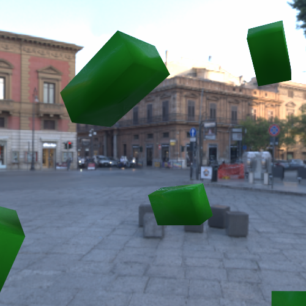
</p>

3) Model training \
With the generated data, the model can be trained. This step is the longest and can take more than a week. The time depends on how much training data is used and how many epochs the model trains (usually>60).

4) Run inference \
The inference is needed to test the model on generated data and see if it needs more training. The inference script also can be found in [DOPE repositoty](https://github.com/NVlabs/Deep_Object_Pose.git).

<p align="center">
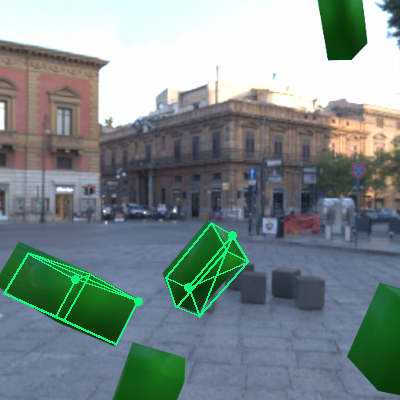
  &nbsp; &nbsp; &nbsp; &nbsp;
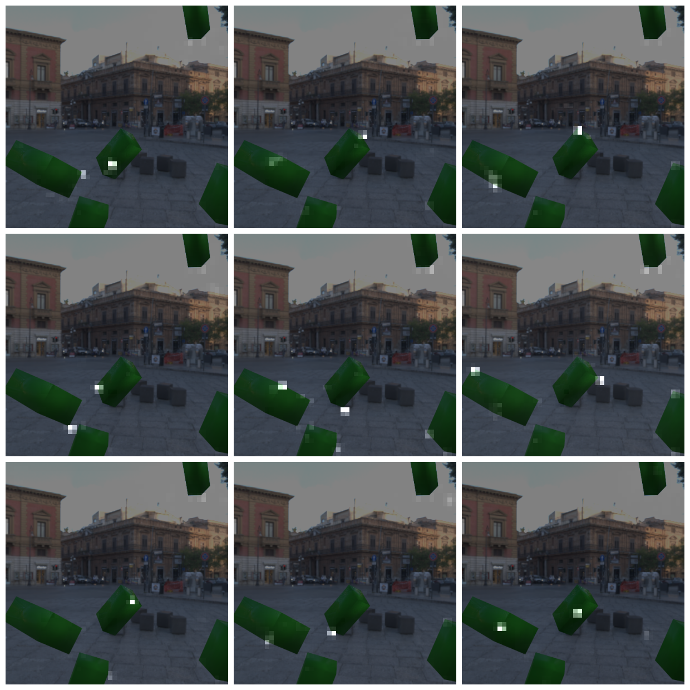
</p>
<p align="center">
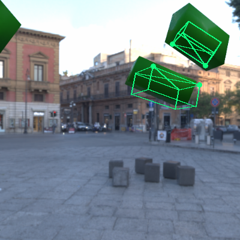
  &nbsp; &nbsp; &nbsp; &nbsp;
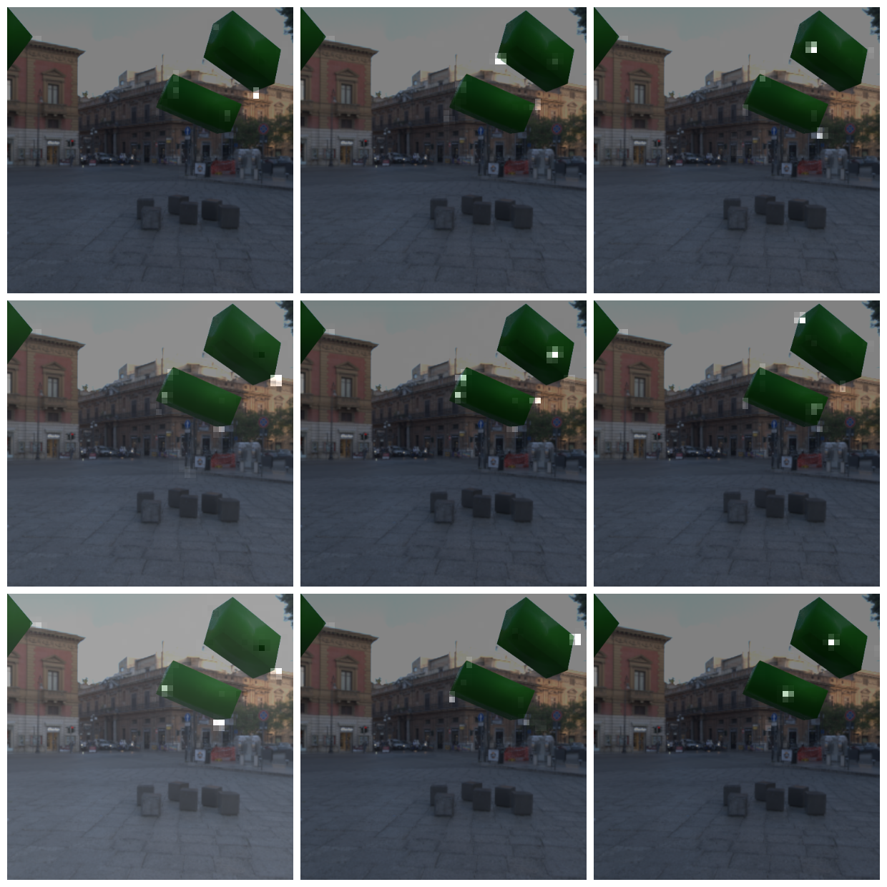
</p>

5) Run pose estimation \
If the inference results are good, the model can be used for pose estimation.

### Start Pose Estimation

```bash
roslaunch pose_estimation pose_estimation.launch dope:=true [height:=0.2]
```
<p align="center">
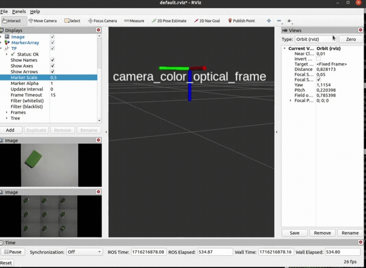
</p>

