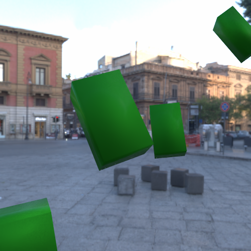

# Pose Estimation

The goal of the project is to estimate the location of the object using camera. In course of compleating the project two approaches were tested. First approach utilises [Find Object](https://github.com/introlab/find-object/tree/noetic-devel) ROS package to estimate objerct's position. This approach relies on image processing and does not require much time for setup, however, it is heavily dependent on fixed camera and lightsource locations. Second approach utilises Deep Object Pose Estimation ([DOPE](https://github.com/NVlabs/Deep_Object_Pose)) where object's pose is detected by a pretrained model. If the model is trained enough, the detection in case of the second approach, can be more reliable in comparison to the first one. However, the training time can take a very long time.

### Test Objects
 


This repository contains two solutions for pose estimation:
1) Using [Find Object](https://github.com/introlab/find-object/tree/noetic-devel)\
Find object package relies on the image processing approach to estimate the location of the object in front of the camera. It takes a reference image of the object and tries to find similar points on the input image.

2) Using [DOPE](https://github.com/NVlabs/Deep_Object_Pose)\
Deep Object Pose Estimation (DOPE) relies on the machine learning approach estimate the location of the object in front of the camera.

### Setup
 * [Ubuntu 20.04](https://releases.ubuntu.com/focal/)
 * [ROS Noetic](http://wiki.ros.org/noetic/Installation/Ubuntu)
 * [Jetson Nano](https://developer.nvidia.com/embedded/learn/get-started-jetson-nano-devkit)
 * [RealSense](https://github.com/IntelRealSense/realsense-ros#installation-instructions)
 * [Find Object](https://github.com/introlab/find-object)

 

### Setup the workspace
```bash
sudo apt-get install ros-$ROS_DISTRO-find-object-2d
```
```bash
cd
mkdir -p pose_estimation/src
cd ~/pose_estimation/src
git clone https://github.com/patsyuk03/pose_estimation.git
cd ~/pose_estimation
catkin build
source devel/setup.bash
```
The workspace contains two packages for approaches described above. 

## Pose Estimation using Find Object

In this approach the object is detected based on the similarities between the reference image and input image. Adding new object does not take much time. The downside of this method is that some objects are much harder to detect then other. For example the Gear object is easily detected with only one reference image. However, the Fork object needs multiple reference images to make it detectable from different locations. There are couple of reasons why object can be hard to detect:
1) Light reflection - metalic objects that reflect light are hard to detect because the detection heavily depends on lightning. When the reflective object is moved the differences between reference image and input image increase due to different light reflection.
2) Not enoiugh structure - the more there are light and dark regions the more datapoints there are for comparison. If an object has smooth surface without any shadows there will be not enough points for comparison. 

### Reference images for the Gear and Fork object 


### Start Pose Estimation
The following command brings up _realsense camera_ and positions it facing downwards using _static transform publisher_. Then it calls _find object_ that starts to detect objects from the image topic published by camera node. Finaly the coordinates are transformed to the correct frame and published to topic _/object_pose_ that can be visualized in RViz. The camera's distance from the table can be modified by the _height_ argument.
```bash
roslaunch pose_estimation pose_estimation.launch [rviz:=true] [height:=0.2]
```


### Add New Object
To add new object we need to use GUI provided by find_object package. Some objects need more then one snapshots to be normally detected in different positions since this approach is heavily dependent on the lightning.  
```bash
roslaunch pose_estimation pose_estimation.launch add_objects:=true
```


## Pose Estimation using DOPE
```
@inproceedings{tremblay2018corl:dope,
 author = {Jonathan Tremblay and Thang To and Balakumar Sundaralingam and Yu Xiang and Dieter Fox and Stan Birchfield},
 title = {Deep Object Pose Estimation for Semantic Robotic Grasping of Household Objects},
 booktitle = {Conference on Robot Learning (CoRL)},
 url = "https://arxiv.org/abs/1809.10790",
 year = 2018
}
```
Deep Object Pose Estimation (DOPE) is using machine learning approach to find object's location. Using DOPE for pose estimation requires much more time for preparation in comparison to Find Object. The most time consuming part is model training and data generation. Here are the steps that need to be completed before running object detection:

1) 3D Model creation \
First the 3D model of the object needs to be created. This can be done using SolidWorks and exporting the resulting object in the .stl format. Then using MeshLab apply the texture (color of the object) and save as .obj, it should also generate texture.png file and .mtl. 


2) Data generation \
For model training data needs to be generated. This can be done using script form [DOPE repositoty](https://github.com/NVlabs/Deep_Object_Pose.git). The process of data generation can take more then 12 hours depending on how many images are set to be generated (usualy 20000 should be enough)





3) Model training \
With the generated data the model can be trained. This step is the longest and can take more then a week in total. The time depends on how mach taining data is used and for how many epoch the model is trained (usualy >60).

4) Run inference \
The inference is needed to test the model on generated data and see if it needs more training. Inference script also can be found in [DOPE repositoty](https://github.com/NVlabs/Deep_Object_Pose.git). 


5) Run pose estimatioin \
If the results of inference are good the model can be used for pose estimation.

### Start Pose Estimation

```bash
roslaunch pose_estimation pose_estimation.launch dope:=true [height:=0.2]
```


